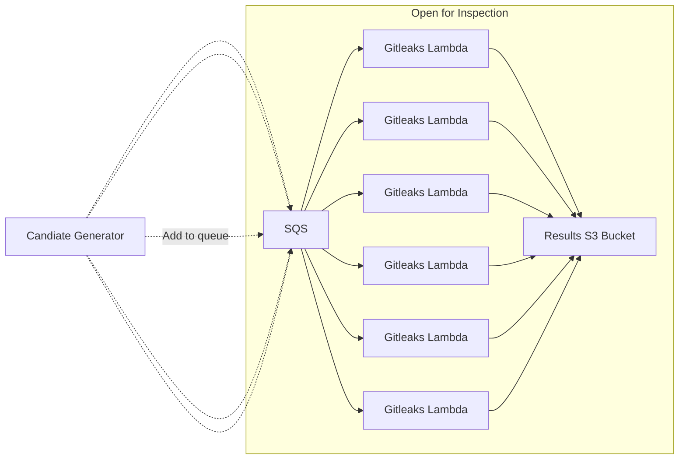

# Open for Inspection

An AWS Lambda function to run [gitleaks](https://github.com/gitleaks/gitleaks) on a target public repository.

By using a Lambda function, many scans are able to be run in parallel at low cost.

The eventual goal would be to paired this with another tool which identifies candidate repositories to scan, and places the repository URL into an SQS event queue, to be picked up by the `gitleaks` Lambda.

## Architecture Diagram



## Viewing Results

[DuckDB](https://duckdb.org/) is great for viewing results.

```sql
-- S3 connection requires the httpfs extension
INSTALL httpfs;
LOAD httpfs;

-- Specify that you want to provide the creds from env/IMDS
CREATE SECRET secret_s3 (
   TYPE S3,
   PROVIDER CREDENTIAL_CHAIN
);

SELECT Description,Secret,File,Commit FROM 's3://my-result-bucket/2024-07-06/*.json';
┌──────────────────────┬──────────────────────┬────────────────────────────────────┬──────────────────────────────────────────┐
│     Description      │        Secret        │                File                │                  Commit                  │
│       varchar        │       varchar        │              varchar               │                 varchar                  │
├──────────────────────┼──────────────────────┼────────────────────────────────────┼──────────────────────────────────────────┤
│ Uncovered a GitHub…  │ ghp_XXXXXXXXXXXXXX…  │ git-migration.sh                   │ XXXXXXXXXXXXXXXXXXXXXXXXXXXXXXXXXXXXXXXX │
│ Uncovered a GitHub…  │ ghp_XXXXXXXXXXXXXX…  │ git-migration.sh                   │ XXXXXXXXXXXXXXXXXXXXXXXXXXXXXXXXXXXXXXXX │
| ...
...
```